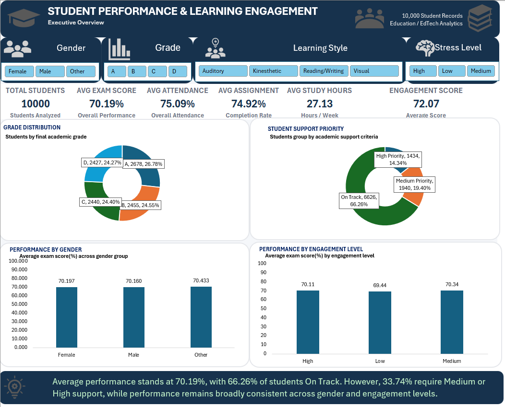
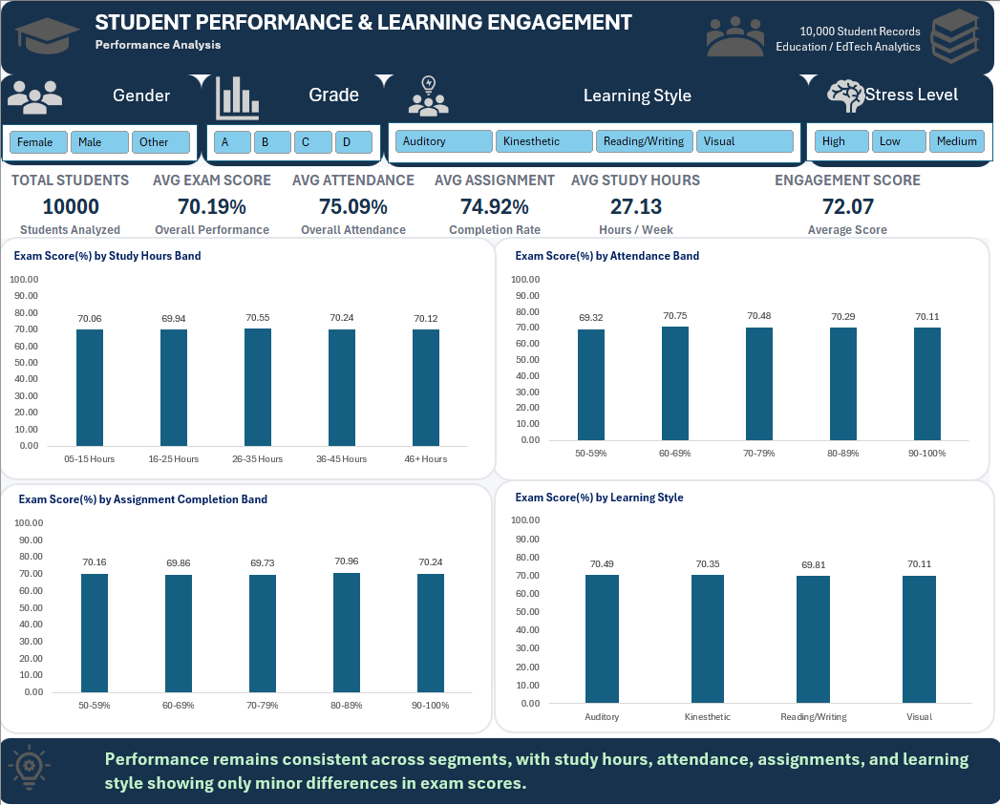

# Student Performance & Learning Engagement Analytics

## Project Overview

This Excel analytics project analyzes **10,000 student records** to
understand academic performance, learning engagement, student support
needs, and variation in exam scores across key student factors.

The project was built entirely in **Microsoft Excel** and demonstrates
an end-to-end analytics workflow covering data validation, analytical
feature engineering, PivotTable analysis, interactive dashboards,
insight generation, and recommendations.

## Business Problem

Educational institutions need a clear way to monitor student performance
and identify students who may require additional support. This project
converts student-level academic and engagement data into an interactive
Excel reporting solution that helps answer:

-   What is the overall level of student academic performance?
-   How are final grades distributed?
-   How many students may require additional academic support?
-   How does exam performance vary by study hours, attendance,
    assignment completion, and learning style?
-   Are there meaningful performance differences across student
    segments?
-   What actions can be considered based on the findings?

## Dataset

-   **Records:** 10,000 students
-   **Raw fields:** 15
-   **Domain:** Education / EdTech Analytics
-   **Tool:** Microsoft Excel

The raw dataset includes student demographics, study hours, learning
style, online course completion, discussion participation, assignment
completion, exam score, attendance, educational technology usage, stress
level, social media usage, sleep hours, and final grade.

> **Analytical limitation:** The dataset does not contain a date,
> semester, or academic-year field. Therefore, this project focuses on
> cross-sectional comparisons rather than time-series trends. Observed
> relationships are descriptive associations and should not be
> interpreted as causal effects.

## Excel Skills Demonstrated

-   Excel Tables and structured references
-   Data cleaning and validation checks
-   IF / IFS and logical formulas
-   Analytical banding and segmentation
-   PivotTables and PivotCharts
-   Slicers and interactive filtering
-   KPI development
-   Dashboard design and formatting
-   Percentage-point spread analysis
-   Data storytelling and recommendations

## Analytical Model

The project extends the raw student data with analytical fields
including:

-   Age Band
-   Study Hours Band
-   Attendance Band
-   Assignment Completion Band
-   Performance Band
-   Sleep Band
-   Social Media Band
-   Support Priority
-   Engagement Score
-   Engagement Level

These fields support student segmentation and dashboard analysis without
altering the original raw dataset.

## Key KPIs

  KPI                                       Result
  ------------------------------- ----------------
  Total Students                            10,000
  Average Exam Score                        70.19%
  Average Attendance                        75.09%
  Average Assignment Completion             74.92%
  Average Study Hours               27.13 hrs/week
  Average Engagement Score                   72.07

## Key Insights

### 1. Overall Performance

The average exam score is **70.19%**, while the final-grade distribution
is relatively balanced:

-   Grade A: **26.78%**
-   Grade B: **24.55%**
-   Grade C: **24.40%**
-   Grade D: **24.27%**

### 2. Student Support Priority

Most students are classified as **On Track**, but a meaningful portion
may require additional support:

-   On Track: **66.26%**
-   Medium Priority: **19.40%**
-   High Priority: **14.34%**

Combined, **33.74%** of students fall into the Medium or High Priority
groups.

### 3. Performance Drivers

Average exam performance varies only modestly across the factors
analyzed. Using the difference between the highest- and
lowest-performing segment within each factor:

  Factor                         Exam Score Spread
  ----------------------- ------------------------
  Study Hours               0.60 percentage points
  Attendance                1.43 percentage points
  Assignment Completion     1.23 percentage points
  Learning Style            0.68 percentage points

Attendance shows the largest spread among these factors, but the overall
differences remain small.

### 4. Learning Style

**Auditory learners** record the highest average exam score at
**70.49%**. However, the difference between learning-style groups is
less than one percentage point, so it should not be treated as a strong
performance advantage.

## Recommendations

1.  **Prioritize student support** --- Focus attention on the 33.74% of
    students classified as Medium or High Priority.
2.  **Monitor multiple indicators** --- Review attendance, assignment
    completion, engagement, study behavior, and performance together
    instead of relying on one metric.
3.  **Use targeted student support** --- Use student-level indicators to
    identify and prioritize students who may need additional academic
    assistance.
4.  **Enable future trend analysis** --- Add semester/date fields to
    future datasets so performance and engagement can be tracked over
    time.

## Dashboard Pages

### Executive Dashboard

Provides an at-a-glance view of overall student performance, grade
distribution, support priority, gender performance, and engagement-level
performance.



### Performance Analysis

Examines average exam performance across study-hour bands, attendance
bands, assignment-completion bands, and learning styles.



### Insights & Recommendations

Summarizes the major findings, performance variation, student support
requirements, and recommended actions.


## Workbook Structure

  Worksheet                   Purpose
  --------------------------- --------------------------------------------
  `01_README`                 In-workbook project documentation
  `02_Student Dataset`        Original student dataset
  `03_DATA_CHECKS`            Data-quality and validation checks
  `04_STUDENT_ANALYSIS`       Analytical fields and student segmentation
  `05_PIVOT_ANALYSIS`         PivotTables and supporting analysis
  `06_EXECUTIVE_DASHBOARD`    Executive-level interactive dashboard
  `07_PERFORMANCE_ANALYSIS`   Detailed performance analysis
  `08_INSIGHTS`               Key insights and recommendations

## Suggested Repository Structure

``` text
Student-Performance-Learning-Engagement-Analytics/
│
├── README.md
├── Student_Performance_Analytics.xlsx
├── data/
│   └── Student_Dataset.csv
│
└── screenshots/
    ├── 01_Executive_Dashboard.png
    ├── 02_Performance_Analysis.png
    ├── 03_Insights_and_Recommendations.png
    └── 04_Data_Quality_Checks.png
```

## Project Workflow

**Raw Data → Data Checks → Student Analysis → Pivot Analysis → Executive
Dashboard → Performance Analysis → Insights & Recommendations**

## Key Takeaway

> **Overall performance is stable, but one-third of students require
> additional support. A multi-factor approach is more appropriate than
> relying on any single performance indicator.**
---

## About This Project

This project was developed as part of my Data Analytics portfolio to demonstrate an end-to-end Excel analytics workflow — from data validation and transformation to KPI development, interactive dashboarding, insight generation, and business recommendations.

The focus was not only on building charts, but on converting student-level data into clear and actionable analytical insights.

### Skills Demonstrated

`Advanced Excel` • `Data Cleaning` • `Data Validation` • `PivotTables` • `PivotCharts` • `Slicers` • `KPI Analysis` • `Dashboard Design` • `Data Storytelling`

---

### 👤 Author

**Akshay Aswani**  
Aspiring Data Analyst | SQL • Power BI • Excel • Python

🌐 **Portfolio:** aaswani365.github.io  
💻 **GitHub:** @aaswani365

---

⭐ If you found this project useful or interesting, feel free to explore my other data analytics projects.
